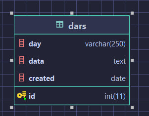
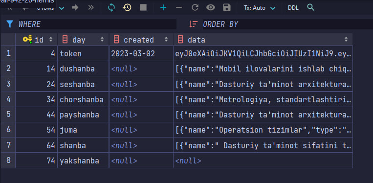

TATU UF Hemis tizimi talaba API si orqali dars jadvali olib telegramda 
yuboruvchi bot.
 
Yaratish jarayonida <a href="https:://heroku.com">Heroku</a> dan foydalanilgani uchun commitlar soni ko'p.
 
Botning ishlash tartibi: 
har soatda bot hemis tizimidan dars jadvalani olib malumotlar bazasiga yozadi.
buning uchun 'cron.php' ni ishga tushirish lozim.
 
Heroku tizimida foydalanilgan add-onlari: 
[ClearDB](https://elements.heroku.com/addons/cleardb) - malumotlar bazasi
 
[Scheduler](https://elements.heroku.com/addons/scheduler) - cron ishga tushirish uchun
 
Malumitlar bazasida faqat `dars` jadvali mavjud:
 

`env.example` faylidan `.env` faylini yaratib, uni to'ldiring.
Boshqa guruhlar uchun foydalanish uchun `.env` fayldagi maydonlarni to'ldirish lozim
`TELEGRAM_BOT_TOKEN` - bot tokeni
`HEMIS_USERNAME` - hemis logini
`HEMIS_PASSWORD` - hemis paroli
qaysi talaba login paroli kiritilsa shu talaba o'quvchi gurh dars jadvalini olishi mumkin.
